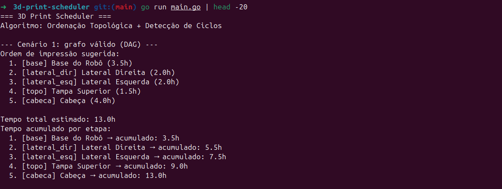
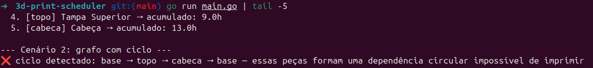
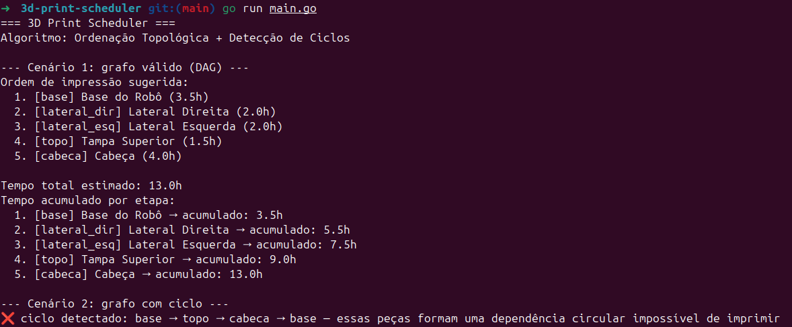

# 3D-Print-Scheduler

Número da Lista: 55<br>
Conteúdo da Disciplina: Grafos<br>

## Alunos

| Matrícula | Aluno |
| -- | -- |
| 19/0102977 | Artur Ricardo dos Santos Lopes |

## Sobre

O **3D Print Scheduler** é um agendador de ordem de impressão 3D baseado em teoria dos grafos. Em impressoras FDM, certas peças de uma montagem dependem de outras já estarem prontas na mesa — seja por suporte físico ou encaixe sequencial. O projeto modela esse problema como um **Grafo Acíclico Dirigido (DAG)**, onde cada nó representa uma peça a ser impressa e cada aresta dirigida `A → B` indica que a peça `A` deve ser impressa antes da peça `B`.

### Como funciona

1. O usuário define as peças (`PrintPart`) com ID, nome e tempo estimado de impressão
2. O usuário declara as dependências entre peças (`AddDependency`)
3. O algoritmo de **Ordenação Topológica via DFS** determina uma sequência de impressão válida
4. Caso exista uma dependência circular, o sistema detecta o **ciclo** e exibe o caminho completo do loop (ex: `base → topo → cabeça → base`), prevenindo uma ordem de impressão impossível
5. Ao final, são exibidas as **métricas de tempo**: total estimado e tempo acumulado etapa a etapa

### Estrutura do projeto

```
3d-print-scheduler/
├── main.go                        # ponto de entrada, dois cenários de demonstração
└── scheduler/
    ├── graph.go                   # structs PrintPart e DependencyGraph (lista de adjacência)
    ├── topological_sort.go        # DFS com coloração de nós e detecção de ciclos
    └── metrics.go                 # cálculo de tempo total e acumulado por etapa
```

### Conceitos aplicados

- **Grafo Dirigido** com representação por lista de adjacência
- **Ordenação Topológica** via busca em profundidade (DFS)
- **Detecção de Ciclos** com coloração de nós (branco / cinza / preto) — abordagem clássica do CLRS (*Introduction to Algorithms*)

## Apresentação em Vídeo

> 🎥 A apresentação do projeto está disponível no YouTube:

**[assistir ao vídeo →](https://www.youtube.com/watch?v=LINK_AQUI)**

## Screenshots

**Cenário 1 — Grafo válido (DAG): ordenação topológica e tempo acumulado**



**Cenário 2 — Grafo com ciclo: dependência circular detectada com caminho completo**



**Saída completa do programa**



## Instalação

Linguagem: Go (Golang) 1.22+<br>
Framework: nenhum (biblioteca padrão apenas)<br>

**Pré-requisitos:**

- Ter o [Go](https://go.dev/dl/) instalado (versão 1.22 ou superior)
- Verificar instalação com `go version`

**Passos:**

```bash
# Clone o repositório
git clone https://github.com/projeto-de-algoritmos-2026/G55_Grafos_PA-26.1.git

# Entre na pasta do projeto
cd G55_Grafos_PA-26.1/3d-print-scheduler

# Baixe as dependências
go mod tidy

# Compile e execute
go run main.go
```

## Uso

Ao executar, o programa roda dois cenários automaticamente:

**Cenário 1 — DAG válido**: monta um grafo de peças de um robô, exibe a ordem de impressão sugerida e o tempo acumulado por etapa.

**Cenário 2 — Ciclo**: monta um grafo com dependência circular intencional e exibe a mensagem de erro com o caminho completo do loop.

Para testar com suas próprias peças, edite os slices `pecas` e `dependencias` dentro de `rodarCenarioValido()` no `main.go`:

```go
pecas := []*scheduler.PrintPart{
    {ID: "minha_base", Name: "Base Customizada", EstimatedHours: 2.5},
    // adicione suas peças aqui
}

dependencias := [][2]string{
    {"minha_base", "outra_peca"},
    // adicione suas dependências aqui
}
```

## Outros

- Projeto desenvolvido para a disciplina **Projeto de Algoritmos (2026.1)** na Universidade de Brasília (UnB)
- A detecção de ciclos usa coloração de nós inspirada no CLRS: nó **cinza** sendo revisitado durante a DFS indica presença de ciclo
- Trabalhos futuros incluem: leitura de grafos via arquivo YAML, interface visual do DAG no terminal e suporte a pesos nas arestas (ex: tempo de espera entre impressões)
